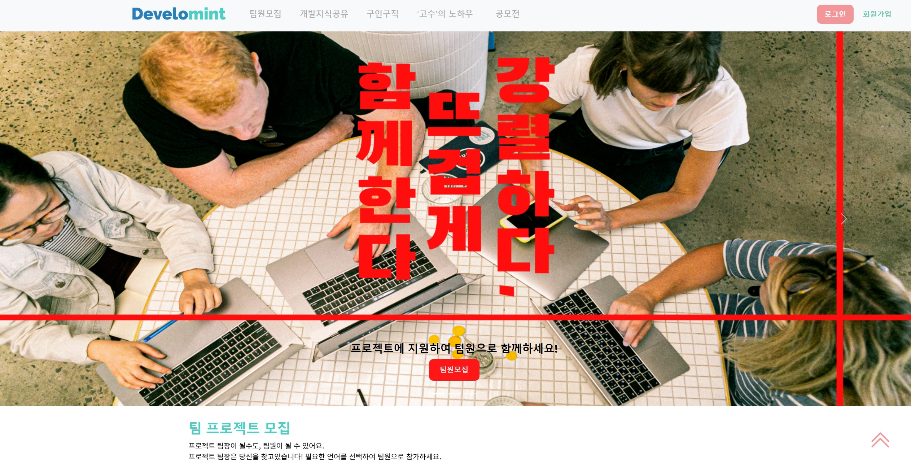
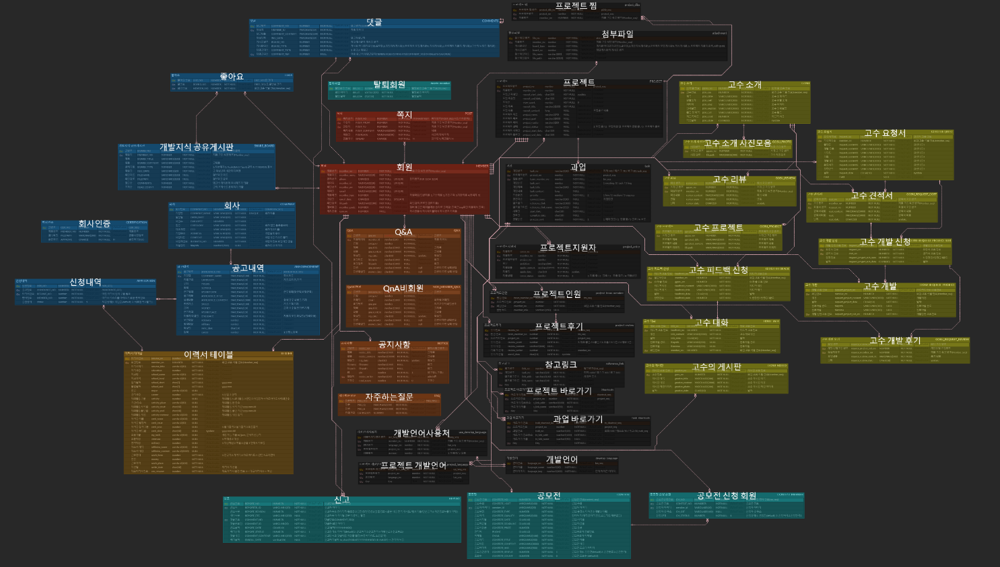

# develomint

  
   <b>프로젝트 팀 모집부터 구인구직, 프리랜서 이용 등 개발자를 위한 종합 커뮤니티</b>
   
  

    

> 서비스명: develomint      
> 개발기간: 2021.11.25 ~ 2021.12.29 (약 5주)   

## 팀원 역할   
| 이름   | 역할 | 내용                        |
| ------ | ---- | --------------------------- |
| 김진호 | 팀장 | 풀스택 개발, 마이페이지, 로그인&회원가입, 지식공유게시판, 실시간알림쪽지 |
| 김수현 | 팀원 | 풀스택 개발, 관리자페이지, 공모전게시판 |
| 김민주 | 팀원 | 풀스택 개발, 메인화면, 헤드&풋터, 공지사항, QnA |
| 강세희 | 팀원 | 풀스택 개발, 고수의노하우, 회사소개페이지, 고수의노하우 소개 페이지 |
| 이슬기 | 팀원 | 풀스택 개발, 자주 묻는 질문, 구인구직 게시판, 이용안내&고객센터 |
| 정민우 | 팀원 | 풀스택 개발, 프로젝트 팀 모집, 프로젝트 과업관리 |

   
     

## 서비스 개요      
기존 틀에 박힌 개발자 커뮤니티에 탈피하여, 개발 프로젝트 팀 모집부터 구인구직, 공모전, 프리랜서 서비스 등 개발자를 위한 다양한 서비스들을 제공하는 종합 개발 커뮤니티 플랫폼입니다.

   
 

### 사용기술      

   
  

### ER 다이어그램      

   
  

## 주요 기능

* **팀 모집 페이지** 
> 

 

* **프로젝트 과업 관리 페이지** 
> 

 

* **로그인, 회원가입** 
> 

 

* **마이페이지** 
> 

 

* **개발지식공유 게시판 & 쪽지** 
> 

 
 
